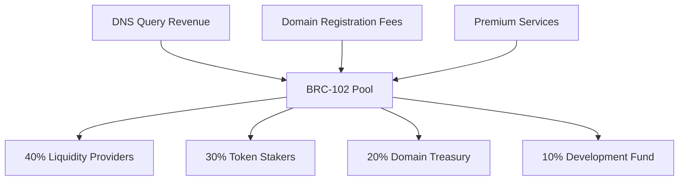

# BRC-100 Integration Guide

## Overview

Bitcoin DNS has migrated from custom smart contracts to the **BRC-100 protocol stack**, providing enterprise-grade governance, automated market making, and cross-chain compatibility through proven, battle-tested protocols.

## Protocol Stack Architecture

```
┌─────────────────────────────────────────────────────────────┐
│                   Bitcoin DNS on BRC-100                    │
├─────────────────────────────────────────────────────────────┤
│  BRC-101 Governance  │  BRC-102 AMM     │  BRC-103 Bridge  │
│  - Token voting      │  - Revenue dist  │  - Cross-chain   │
│  - Proposals         │  - Liquidity     │  - Asset bridge  │
│  - Proof execution   │  - Price disc    │  - Multi-domain  │
├─────────────────────────────────────────────────────────────┤
│                     BRC-100 Base Layer                     │
│  - UTXO + State Machine Model                             │
│  - Inscription-based Operations                           │
│  - Nested Applications Support                            │
└─────────────────────────────────────────────────────────────┘
```

## BRC-101 Governance Integration

### Domain Governance Token

Each domain creates a BRC-100 token with BRC-101 governance extension:

```javascript
// Domain token deployment
const domainToken = {
  p: 'BRC-100',
  op: 'deploy',
  tick: '$bDNS/Coca-Cola', // Unique ticker per domain
  max: '1000000',          // Maximum supply
  lim: '1000',            // Mint limit per operation
  ext: ['BRC-101']        // Enable governance extension
};
```

### Governance Operations

#### 1. Proposal Creation
```javascript
const proposal = {
  p: 'BRC-101',
  op: 'proposal',
  tick: '$bDNS/Coca-Cola',
  type: 'content_update',
  data: {
    contentHash: 'QmYwAPJzv5CZsnA625s3Xf2nemtYgPpHdWEz79ojWnPbdG',
    dnsRecords: [
      { type: 'A', name: 'b.coca-cola.com', value: '203.0.113.42', ttl: 300 }
    ]
  },
  proof: {
    type: 'dns_authority',
    signature: '0x...',
    verifier: 'dns-authority-oracle'
  }
};
```

#### 2. Voting on Proposals
```javascript
const vote = {
  p: 'BRC-101',
  op: 'vote',
  tick: '$bDNS/Coca-Cola',
  proposalId: 'prop_123456',
  vote: 'approve',
  amount: '50000' // Token amount for weighted voting
};
```

#### 3. Proposal Execution
```javascript
const execution = {
  p: 'BRC-101',
  op: 'execute',
  tick: '$bDNS/Coca-Cola',
  proposalId: 'prop_123456',
  proof: { /* execution proof data */ }
};
```

### Proof Integration

BRC-101's native proof support enables secure DNS updates:

```javascript
// DNS authority proof
const dnsProof = {
  type: 'dns_authority',
  data: {
    domain: 'coca-cola.com',
    txtRecord: '_bitcoin-dns-verify=abc123def456',
    signature: 'validSignatureFromDomainOwner'
  },
  timestamp: Date.now(),
  verifier: 'dns-authority-oracle.com'
};

// SSL certificate proof
const sslProof = {
  type: 'ssl_certificate',
  data: {
    certificate: 'MIIEpDCCA4ygAwIBAgIJAL...',
    commonName: 'coca-cola.com',
    validFrom: '2025-01-01',
    validTo: '2026-01-01'
  },
  timestamp: Date.now(),
  verifier: 'ssl-verification-service.com'
};
```

## BRC-102 Automated Market Making

### Liquidity Pool Creation

Each domain creates a BRC-102 AMM pool for automated revenue distribution:

```javascript
const poolDeployment = {
  p: 'BRC-102',
  op: 'deploy',
  tick: '$bDNS/Coca-Cola',
  formula: 'x*y=k',        // Constant product formula
  fee: '0.003',            // 0.3% trading fee
  reserves: {
    token: '100000',       // Initial token reserves
    btc: '50000'          // Initial BTC reserves (satoshis)
  }
};
```

### Revenue Distribution Flow



### Automated Distribution

```javascript
// Revenue input to pool
const revenueInput = {
  p: 'BRC-102',
  op: 'add_revenue',
  tick: '$bDNS/Coca-Cola',
  amount: '10000',         // satoshis
  source: 'dns_queries'
};

// Automatic distribution triggered
const distribution = {
  p: 'BRC-102',
  op: 'distribute',
  tick: '$bDNS/Coca-Cola',
  totalAmount: '10000',
  allocations: {
    liquidity: '4000',     // 40%
    staking: '3000',       // 30%
    treasury: '2000',      // 20%
    development: '1000'    // 10%
  }
};
```

### Trading Operations

```javascript
// Swap BTC for domain tokens
const swap = {
  p: 'BRC-102',
  op: 'swap',
  tick: '$bDNS/Coca-Cola',
  inputToken: 'BTC',
  inputAmount: '5000',
  outputToken: 'TOKEN',
  slippage: '0.05'         // 5% max slippage
};

// Add liquidity to pool
const addLiquidity = {
  p: 'BRC-102',
  op: 'add',
  tick: '$bDNS/Coca-Cola',
  tokenAmount: '1000',
  btcAmount: '500'
};
```

## BRC-103 Cross-Chain Bridging

### Cross-Domain Asset Bridging

```javascript
// Bridge assets between domain pools
const bridge = {
  p: 'BRC-103',
  op: 'bridge',
  fromTick: 'BDNS-COCA-COLA',
  toTick: 'BDNS-PEPSI',
  amount: '1000',
  bridgeType: 'domain_share_exchange'
};
```

### Nested Domain Architecture

```javascript
// Parent domain
const parentDomain = {
  tick: '$bDNS/Coca-Cola',
  children: [
    'BDNS-COCA-COLA:EUROPE',    // Regional governance
    'BDNS-COCA-COLA:MARKETING', // Department governance
    'BDNS-COCA-COLA:PRODUCTS'   // Product line governance
  ]
};

// Child domain deployment
const childDomain = {
  p: 'BRC-100',
  op: 'deploy',
  tick: 'BDNS-COCA-COLA:EUROPE',
  parent: 'BDNS-COCA-COLA',
  max: '100000',
  ext: ['BRC-101', 'BRC-102']
};
```

## Implementation Details

### Domain Registration Process

1. **Domain Verification**
   ```javascript
   // Step 1: Verify domain ownership
   const verification = await verifyDomainOwnership('coca-cola.com');
   
   // Step 2: Deploy BRC-100 token
   const tokenDeployment = deployBRC100Token('BDNS-COCA-COLA', {
     extensions: ['BRC-101', 'BRC-102'],
     governance: {
       votingPeriod: 604800,      // 7 days in seconds
       quorum: 0.1,               // 10% participation required
       threshold: 0.51            // 51% approval required
     }
   });
   
   // Step 3: Create BRC-102 liquidity pool
   const poolCreation = deployBRC102Pool('BDNS-COCA-COLA', {
     initialTokens: 100000,
     initialBTC: 50000,
     feeRate: 0.003
   });
   ```

2. **Share Distribution**
   ```javascript
   // Initial share distribution
   const shares = [
     { recipient: 'company-treasury', amount: 700000 },  // 70%
     { recipient: 'founders', amount: 200000 },          // 20%
     { recipient: 'employees', amount: 100000 }          // 10%
   ];
   
   await distributeInitialShares('BDNS-COCA-COLA', shares);
   ```

### DNS Resolution Integration

```javascript
class BRC100DNSResolver {
  async resolveSubdomain(domain: string): Promise<DNSRecord[]> {
    // 1. Extract domain ticker
    const ticker = this.domainToTicker(domain); // b.coca-cola.com -> BDNS-COCA-COLA
    
    // 2. Query BRC-100 state for latest governance decisions
    const latestConfig = await this.queryBRC100State(ticker);
    
    // 3. Return DNS records from approved proposals
    return latestConfig.dnsRecords;
  }
  
  async proposeConfigUpdate(
    domain: string, 
    newRecords: DNSRecord[], 
    proof: ProofData
  ): Promise<string> {
    const ticker = this.domainToTicker(domain);
    
    // Create BRC-101 proposal with proof
    const proposal = {
      p: 'BRC-101',
      op: 'proposal',
      tick: ticker,
      type: 'subdomain_config',
      data: { dnsRecords: newRecords },
      proof
    };
    
    return await this.submitInscription(proposal);
  }
}
```

### Revenue Processing

```javascript
class BRC102RevenueProcessor {
  async processRevenue(domain: string, amount: number, source: string): Promise<void> {
    const ticker = this.domainToTicker(domain);
    
    // Add revenue to BRC-102 pool
    const revenueInscription = {
      p: 'BRC-102',
      op: 'add_revenue',
      tick: ticker,
      amount: amount.toString(),
      source
    };
    
    await this.submitInscription(revenueInscription);
    
    // Trigger automatic distribution
    await this.triggerDistribution(ticker);
  }
  
  async triggerDistribution(ticker: string): Promise<void> {
    const pool = await this.getBRC102Pool(ticker);
    const pendingRevenue = pool.pendingRevenue;
    
    if (pendingRevenue >= 1000) { // Minimum threshold
      const distribution = {
        p: 'BRC-102',
        op: 'distribute',
        tick: ticker,
        amount: pendingRevenue.toString()
      };
      
      await this.submitInscription(distribution);
    }
  }
}
```

## Migration from Custom Contracts

### Phase 1: Token Migration
1. **Deploy BRC-100 Tokens**: Create BRC-100 equivalent for each existing domain
2. **Snapshot Balances**: Record current $BDNS holdings
3. **Airdrop New Tokens**: Distribute BRC-100 tokens to existing holders
4. **Enable Governance**: Activate BRC-101 voting on new tokens

### Phase 2: Revenue System Migration
1. **Deploy BRC-102 Pools**: Create AMM pools for each domain
2. **Migrate Revenue Streams**: Redirect payments to BRC-102 pools
3. **Test Distribution**: Verify automated revenue distribution
4. **Deprecate Old System**: Phase out custom payment contracts

### Phase 3: Cross-Chain Features
1. **Enable BRC-103**: Activate cross-chain bridging
2. **Nested Domains**: Implement parent-child domain relationships
3. **Multi-Chain Support**: Extend to other blockchains via BRC-103
4. **Advanced Features**: Implement staking, delegation, and advanced governance

## Development Tools

### BRC-100 SDK Integration

```bash
npm install brc100-sdk
```

```javascript
import { BRC100Client, BRC101Governance, BRC102AMM } from 'brc100-sdk';

const client = new BRC100Client({
  network: 'mainnet',
  apiKey: process.env.BRC100_API_KEY
});

// Deploy domain governance
const governance = new BRC101Governance(client);
await governance.deployDomainGovernance('BDNS-COCA-COLA', {
  votingPeriod: 604800,
  quorum: 0.1,
  threshold: 0.51
});

// Create liquidity pool
const amm = new BRC102AMM(client);
await amm.createPool('BDNS-COCA-COLA', {
  initialTokens: 100000,
  initialBTC: 50000,
  feeRate: 0.003
});
```

### Testing Framework

```javascript
// Test BRC-101 governance
describe('BRC-101 Domain Governance', () => {
  test('should create proposal with proof', async () => {
    const proposal = await governance.createProposal({
      type: 'content_update',
      data: { contentHash: 'QmTest...' },
      proof: { type: 'dns_authority', data: '...' }
    });
    
    expect(proposal.id).toBeDefined();
    expect(proposal.proofRequired).toBe(true);
  });
  
  test('should execute approved proposal', async () => {
    // Vote with majority tokens
    await governance.vote(proposalId, 'approve', 600000);
    
    // Check execution
    const proposal = await governance.getProposal(proposalId);
    expect(proposal.status).toBe('executed');
  });
});

// Test BRC-102 revenue distribution
describe('BRC-102 Revenue Distribution', () => {
  test('should distribute revenue to stakeholders', async () => {
    await amm.addRevenue(10000, 'dns_queries');
    await amm.triggerDistribution();
    
    const distributions = await amm.getDistributions();
    expect(distributions.liquidity).toBe(4000); // 40%
    expect(distributions.staking).toBe(3000);   // 30%
  });
});
```

## Security Considerations

### Proof Verification
- **DNS Authority**: Verify TXT records and domain ownership
- **SSL Certificates**: Validate certificate chain and domain matching
- **Oracle Integration**: Use trusted external data sources
- **Signature Validation**: Cryptographically verify all proofs

### Governance Security
- **Proposal Validation**: Ensure proposals meet technical requirements
- **Vote Weight Verification**: Confirm token holdings for voting
- **Execution Safeguards**: Validate execution conditions before applying changes
- **Emergency Procedures**: Implement pause mechanisms for critical issues

### AMM Security
- **Slippage Protection**: Limit maximum price impact
- **MEV Resistance**: Use fair ordering and batch processing
- **Liquidity Guards**: Prevent pool manipulation attacks
- **Fee Validation**: Ensure fee rates stay within acceptable bounds

## Performance Optimizations

### Inscription Efficiency
- **Batch Operations**: Combine multiple operations in single inscriptions
- **Data Compression**: Use efficient encoding for large data sets
- **State Caching**: Cache frequently accessed BRC-100 state
- **Indexing**: Maintain local indexes for fast querying

### Scalability Features
- **Nested Pools**: Create hierarchical liquidity structures
- **Delegated Governance**: Allow voting delegation to reduce on-chain activity
- **State Channels**: Use off-chain state for high-frequency operations
- **Lazy Evaluation**: Defer expensive operations until necessary

## Monitoring and Analytics

### BRC-100 Metrics
- **Token Distribution**: Track holder counts and concentration
- **Governance Participation**: Monitor voting rates and proposal activity
- **AMM Performance**: Track volume, fees, and liquidity metrics
- **Cross-Chain Activity**: Monitor bridging volume and asset flows

### Integration Health
- **Proof Success Rate**: Track proof verification success
- **Execution Latency**: Monitor time from proposal to execution
- **Revenue Distribution**: Track payment accuracy and timing
- **Error Rates**: Monitor failed operations and recovery

## Resources

### Documentation
- [BRC-100 Protocol Specification](https://docs.brc100.org/)
- [BRC-101 Governance Guide](https://docs.brc100.org/brc-100-extension-protocols/brc-101-protocol)
- [BRC-102 AMM Documentation](https://docs.brc100.org/brc-100-extension-protocols/brc-102-protocol)
- [BRC-103 Bridge Protocol](https://docs.brc100.org/brc-100-extension-protocols/brc-103-protocol)

### Tools and SDKs
- [BRC-100 SDK](https://github.com/BRC-100-Protocol/BRC-100-SDK)
- [BRC-100 Explorer](https://explorer.brc100.org/)
- [BRC-100 Wallet Integration](https://docs.brc100.org/wallets)

### Community
- [BRC-100 Discord](https://discord.gg/brc100)
- [Bitcoin DNS Developer Chat](https://discord.gg/bitcoin-dns)
- [GitHub Discussions](https://github.com/bitcoin-corp/bitcoin_dns/discussions)

---

The migration to BRC-100 represents a significant advancement in Bitcoin DNS capabilities, providing enterprise-grade infrastructure for decentralized domain governance while maintaining the platform's core mission of democratizing internet infrastructure.