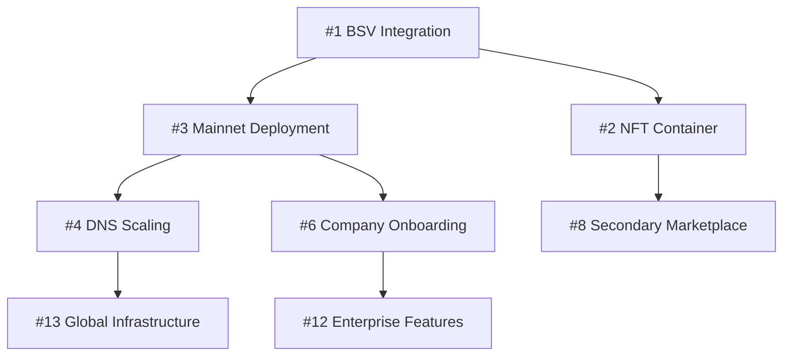

# Bitcoin DNS GitHub Issues

This directory contains detailed issue specifications for Bitcoin DNS development. Each issue includes technical requirements, acceptance criteria, token rewards, and implementation guidance.

## Issue Categories

### 🚀 Phase 1: Foundation (Q1 2025)
**Total Allocation: 25,000,000 $BDNS**

| Issue | Title | Reward | Status | Priority |
|-------|-------|--------|--------|----------|
| [#1](./01-bsv-blockchain-integration.md) | BSV Blockchain Integration | 3,000,000 | 🔄 In Progress | Critical |
| [#2](./02-nft-container-implementation.md) | NFT Container Implementation | 2,500,000 | 📋 Open | High |
| [#3](./03-mainnet-smart-contract-deployment.md) | Mainnet Smart Contract Deployment | 4,000,000 | 📋 Open | Critical |
| [#4](./04-dns-infrastructure-scaling.md) | DNS Infrastructure Scaling | 2,000,000 | 📋 Open | High |
| [#5](./05-security-audits-testing.md) | Security Audits and Testing | 1,500,000 | 📋 Open | Critical |
| [#6](./06-company-onboarding-program.md) | Company Onboarding Program | 1,000,000 | 📋 Open | High |
| [#7](./07-mobile-responsive-interface.md) | Mobile-Responsive Interface | 800,000 | 📋 Open | Medium |

### 🏗️ Phase 2: Production (Q2 2025)
**Total Allocation: 25,000,000 $BDNS**

| Issue | Title | Reward | Status | Priority |
|-------|-------|--------|--------|----------|
| [#8](./08-secondary-marketplace.md) | Secondary Marketplace for Domain Shares | 3,500,000 | 📋 Open | High |
| [#9](./09-advanced-analytics-dashboard.md) | Advanced Analytics Dashboard | 2,000,000 | 📋 Open | Medium |
| [#10](./10-third-party-api.md) | API for Third-Party Integrations | 1,800,000 | 📋 Open | High |
| [#11](./11-multi-chain-support.md) | Multi-Chain Support Exploration | 2,500,000 | 📋 Open | Low |
| [#12](./12-enterprise-features.md) | Enterprise Features and SLA | 1,200,000 | 📋 Open | Medium |

### 🌐 Phase 3: Ecosystem (Q3 2025)  
**Total Allocation: 25,000,000 $BDNS**

| Issue | Title | Reward | Status | Priority |
|-------|-------|--------|--------|----------|
| [#13](./13-global-dns-infrastructure.md) | Global DNS Infrastructure | 5,000,000 | 📋 Open | Critical |
| [#14](./14-institutional-partnerships.md) | Institutional Partnerships | 2,000,000 | 📋 Open | High |
| [#15](./15-advanced-governance.md) | Advanced Governance Features | 3,000,000 | 📋 Open | Medium |
| [#16](./16-cross-domain-interoperability.md) | Cross-Domain Interoperability | 2,500,000 | 📋 Open | Medium |
| [#17](./17-decentralized-autonomous-operation.md) | Decentralized Autonomous Operation | 4,000,000 | 📋 Open | High |

### 🔧 Ongoing Development
**Total Allocation: 25,000,000 $BDNS**

| Category | Allocation | Description |
|----------|------------|-------------|
| Bug Fixes | 5,000,000 | Critical and high-priority bug fixes |
| Documentation | 3,000,000 | Technical docs, guides, and tutorials |
| Performance | 4,000,000 | Optimization and scaling improvements |
| Security | 3,000,000 | Ongoing security improvements |
| Community | 5,000,000 | Community tools and integrations |
| Research | 5,000,000 | R&D for future features |

## Issue Status Legend

- 🔄 **In Progress** - Currently being worked on
- 📋 **Open** - Available for assignment
- ✅ **Completed** - Implementation finished
- 🚫 **Blocked** - Waiting on dependencies
- 🔍 **Under Review** - Code review in progress

## Priority Levels

- **Critical** - Core functionality, security, or blocking other work
- **High** - Important features that significantly impact user experience
- **Medium** - Valuable enhancements that improve the platform
- **Low** - Nice-to-have features for future consideration

## How to Contribute

### 1. Choose an Issue
- Browse open issues and find one that matches your skills
- Check dependencies and ensure prerequisites are met
- Review the corresponding development contract for reward details

### 2. Claim the Issue
- Comment on the GitHub issue expressing interest
- Provide your experience and approach summary
- Wait for assignment from project maintainers

### 3. Development Process
- Fork the repository and create a feature branch
- Follow the technical requirements in the issue
- Write tests and documentation
- Submit a pull request referencing the issue

### 4. Reward Distribution
- Tokens awarded based on completion milestones
- Additional bonuses for early delivery or exceptional quality
- Vesting periods apply as specified in contracts

## Token Reward Structure

### Base Rewards by Complexity
- **Small (1-2 weeks):** 100,000 - 500,000 $BDNS
- **Medium (3-4 weeks):** 500,000 - 1,500,000 $BDNS  
- **Large (5-8 weeks):** 1,500,000 - 3,000,000 $BDNS
- **Critical (8+ weeks):** 3,000,000+ $BDNS

### Bonus Multipliers
- **Early Delivery:** +10-20% bonus for finishing ahead of schedule
- **Quality Excellence:** +5-15% bonus for exceptional code quality
- **Security Focus:** +10-25% bonus for security-critical components
- **Documentation:** +5-10% bonus for comprehensive documentation

### Payment Schedule
- **Milestone-based:** Payments tied to specific deliverables
- **Linear Vesting:** Tokens vest over time after completion
- **Performance Bonuses:** Additional rewards for exceeding expectations

## Issue Dependencies

## Quality Standards

### Code Requirements
- **Test Coverage:** Minimum 80% for new code
- **Documentation:** JSDoc comments for all public APIs
- **Type Safety:** Full TypeScript typing
- **Linting:** Pass ESLint and Prettier checks

### Security Requirements
- **Audit:** Security review for smart contract changes
- **Testing:** Comprehensive test coverage for security-critical code
- **Best Practices:** Follow established security guidelines
- **Review:** Multi-person code review for high-value components

### Performance Requirements
- **DNS Resolution:** <50ms average response time
- **Page Load:** <2s Time to Interactive
- **Transactions:** <1 minute for governance operations
- **Uptime:** 99.9% availability target

## Communication Channels

- **GitHub Issues:** Technical discussion and progress tracking
- **Discord:** Real-time developer chat and support
- **Weekly Calls:** Contributor sync meetings
- **Documentation:** Technical specs and implementation guides

## Support and Questions

- Create a GitHub discussion for general questions
- Join the Discord developer channel for real-time help
- Check existing documentation before asking questions
- Use issue comments for specific technical discussions

---

**Total Development Fund:** 100,000,000 $BDNS (10% of total supply)  
**Current Allocation:** Phase 1-3 + Ongoing (100M $BDNS)  
**Remaining Budget:** Allocated based on community proposals and voting